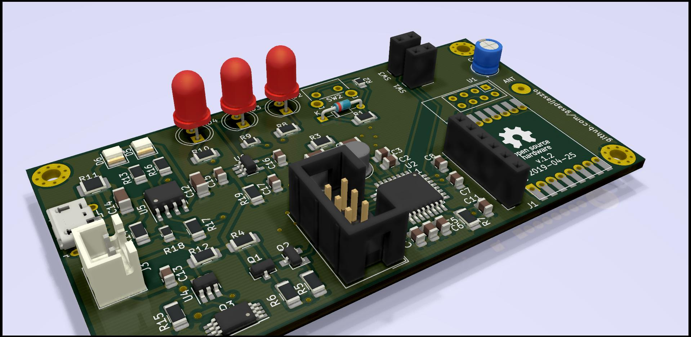

# mySensors_door_switch
a simple door/window sensor with Li-Ion battery circuit, nRF24 radio, mySensors network

work in progress, do not expect to much ;)

## Changes
### ver. 1.1
* corrected battery charging schema and pcb
* battery protection changed from DW01 to FS312 
### ver. 1.2, 29.04.2019
* change of ADC pin
* added second reed switch 
* PCB layout correction
